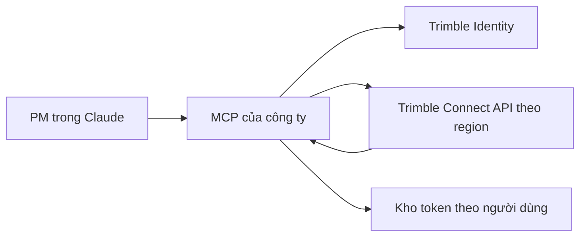

# Kế hoạch xây dựng MCP Trimble Connect: kiểm chứng ở local trước khi triển khai server

**Ngày lập:** 23/09/2026  
**Mục tiêu:** PM hỏi về các dự án Trimble Connect từ Claude qua MCP riêng của doanh nghiệp. Trước khi triển khai production, chứng minh được đường đi **người dùng → MCP → Trimble Identity/Connect → kết quả theo quyền của người dùng** trên máy phát triển.

## 1. Phạm vi và tiêu chí hoàn thành

### MVP local

- Kết nối một ứng dụng đã đăng ký với Trimble Identity bằng OAuth Authorization Code + PKCE.
- Mỗi người thử nghiệm đăng nhập bằng tài khoản Trimble riêng; MCP gọi Connect API bằng token tương ứng.
- Đọc danh sách dự án, chi tiết dự án và một loại dữ liệu thực tế có sẵn trong dự án thử nghiệm (ví dụ thư mục/tệp hoặc BCF topic). Sau khi xác minh dữ liệu, triển khai thêm tool tổng hợp.
- Gọi được các MCP tool từ Inspector, sau đó kiểm tra tích hợp với Claude trong môi trường hỗ trợ.
- Có bằng chứng kiểm tra phân quyền với hai người dùng có phạm vi dự án khác nhau.

**Chưa coi là xong MVP chỉ vì OAuth trả token.** Phải lấy được dữ liệu dự án thực và gọi được tool MCP. Các câu “dự án đang chậm” đòi hỏi dữ liệu tiến độ hoặc quy tắc tính tiến độ; chỉ có danh sách project, issue và ToDo thì chưa đủ kết luận dự án trễ so với kế hoạch.

### Sau MVP

- Thêm Core files/folders/activities, Topics/BCF, ToDos nếu API và dữ liệu tài khoản thực tế hỗ trợ; sau đó khảo sát Model/Organizer/Property Set.
- Tích hợp schedule, ERP, DMS hoặc hợp đồng theo nhu cầu thực; làm cache, worker và dashboard sau khi xác định được chỉ số cần dùng.

## 2. Kiến trúc mục tiêu



- **Danh tính đầu vào:** xác định chắc chắn người đang gọi MCP là ai và ánh xạ với lần đăng nhập Trimble của chính người đó. Không chấp nhận tham số `user_id` do lời gọi tool tự khai để chọn token.
- **Danh tính đầu ra:** Trimble quyết định quyền truy cập đối với request dùng token người dùng. MCP vẫn phải kiểm tra thêm quyền nội bộ nếu có giới hạn của doanh nghiệp.
- **MCP tool:** trả dữ liệu có cấu trúc, có `project_id`, thời điểm lấy dữ liệu và nguồn; tránh trả một kết luận tiến độ khi chưa có dữ liệu đủ để chứng minh.
- **Token:** chỉ lưu phía server, mã hóa khi lưu, không đưa vào câu trả lời Claude hay log.
- **Region:** dùng thông tin region/endpoint từ Trimble thay vì cố định mọi project vào một host.

## 3. Các giai đoạn triển khai

| Giai đoạn | Việc làm | Bàn giao/điều kiện qua bước |
|---|---|---|
| 0. Khảo sát | Chọn 1–2 dự án mẫu; liệt kê thực tế có project, folders, BCF topics, ToDos và model hay không. Chốt 2 tài khoản thử nghiệm có quyền khác nhau. Kiểm tra cách đăng ký ứng dụng và callback với Trimble. | Có ứng dụng và thông tin cấu hình, tài khoản thử nghiệm, ma trận dữ liệu sẵn có. |
| 1. OAuth local | Đăng ký callback local chính xác; làm `/auth/trimble/start` và `/auth/trimble/callback`, kiểm tra `state` + PKCE; trao đổi code lấy token, kiểm tra refresh và hủy kết nối. | Đăng nhập xong gọi được API bằng token; không lộ token qua giao diện/log. |
| 2. API client | Viết client HTTP với region discovery, timeout, phân trang, xử lý 401/403/429, retry giới hạn; thử list projects → get project → folders/files hoặc topics. | API trả dữ liệu thật của dự án, phân biệt lỗi thiếu quyền với không có dữ liệu. |
| 3. MCP local | Đưa các hàm đã kiểm chứng thành tool; dùng MCP Inspector gọi `tools/list` và `tools/call`. | Tool trả JSON rõ ràng; lỗi có thông báo và mã phù hợp. |
| 4. Phân quyền | Cho A và B đăng nhập riêng, gọi cùng tool cho project được phép và project bị từ chối; thử reconnect/disconnect, token hết hạn. | A không đọc được dữ liệu chỉ B có quyền; phiên/token không bị lẫn. |
| 5. Claude | Nếu dùng Claude Desktop có hỗ trợ local MCP: thử kết nối trực tiếp trên máy. Nếu dùng Claude web/connector từ cloud: kiểm tra hỗ trợ remote MCP, công bố một URL HTTPS dev qua tunnel có kiểm soát rồi thử. | Claude gọi đúng tool và diễn giải dữ liệu thật có nguồn; URL dev đóng sau khi thử. |
| 6. Server | Đóng gói, cấu hình URL/callback production, đặt sau HTTPS/reverse proxy, chuyển kho token sang nơi lưu bền vững và mã hóa, thiết lập log/giám sát. | Chạy với 2 người dùng thử nghiệm, kiểm tra quyền, refresh, backup, khôi phục và rollback. |

### Giai đoạn 0 — câu hỏi phải trả lời trước khi code

- Ai có quyền đăng ký ứng dụng Trimble Connect và cấu hình callback trong doanh nghiệp? Xác minh yêu cầu cấp quyền, gói sản phẩm và môi trường thử nghiệm với Trimble.
- Dự án mẫu có BCF issue/ToDo thực hay chỉ có file? Tool `open_issues` cần Topics API và dữ liệu BCF; `overdue_todos` chỉ nên làm khi endpoint, trường deadline và quyền đã được xác nhận.
- Mục tiêu thử là **Claude Desktop trên máy** hay **Claude web của công ty**? Phương án kết nối MCP khác nhau.
- Server production có thể kết nối Internet đến Trimble Identity và tất cả endpoint region cần dùng không? Nếu là server nội bộ không Internet thì phải xử lý kết nối mạng trước khi triển khai.

### Giai đoạn 1 — OAuth

1. Đăng ký ứng dụng, URL callback local chính xác với Trimble. Tài liệu Connect có nêu local callback cho desktop app và có thể đăng ký nhiều callback; không mặc định callback ví dụ đã được cấp cho ứng dụng của mình.
2. Bắt đầu đăng nhập: tạo `state` và cặp PKCE mới; lưu trạng thái tạm theo phiên; chuyển người dùng tới Trimble Identity.
3. Callback: kiểm tra `state` và lỗi trả về, đổi code thành token ở backend, lấy và xác thực danh tính Trimble, gắn với danh tính người dùng MCP hiện tại.
4. Làm refresh theo hướng dẫn **Serial PKCE** của Trimble (cặp verifier/challenge mới cho bước refresh); xử lý refresh token xoay vòng và yêu cầu đăng nhập lại nếu refresh thất bại.
5. Không gửi token vào URL hiển thị, phản hồi tool, git, log hoặc file `.env` được commit.

**Điều kiện qua bước:** tài khoản A đăng nhập, ứng dụng lấy dự án mà A được cấp quyền; thử lại sau khi access token hết hạn. Nếu callback hoặc refresh không hoạt động, chưa xây tiếp các tool nghiệp vụ.

### Giai đoạn 2 — Trimble API client

- Tạo một module `TrimbleClient` dùng token hiện hành của người gọi và chọn base URL của đúng region.
- Lấy danh sách region theo tài liệu; xác định cách liệt kê dự án người dùng qua các region rồi lưu ánh xạ `project_id → region`. Đừng lấy `project_id` bất kỳ rồi đoán region.
- Hỗ trợ phân trang; nếu API trả nhiều page, lấy đủ hoặc trả thông tin `next_page`. Có timeout và mã lỗi riêng cho token hết hạn, thiếu quyền, không tìm thấy, giới hạn tốc độ.
- Chỉ đọc dữ liệu trong MVP. Không gọi thao tác ghi/sửa/xóa từ MCP trước khi có thiết kế quyền và xác nhận nghiệp vụ.

**Điều kiện qua bước:** đối chiếu ít nhất một `project_id`, tên, folder/file hoặc BCF topic với giao diện Trimble Connect của cùng tài khoản.

### Giai đoạn 3 — các tool đề xuất

| Tool | Trả về | Điều kiện dữ liệu |
|---|---|---|
| `list_projects()` | ID, tên, region, thông tin cơ bản của các project người gọi thấy được | Core API và phân trang/region chạy đúng |
| `get_project(project_id)` | Thông tin project, URL tham chiếu nếu có | Dự án nằm trong quyền của người gọi |
| `list_project_files(project_id, folder_id?, page?)` | Tệp, thư mục, metadata cơ bản | Project mẫu có file |
| `list_open_topics(project_id, page?)` | BCF topics chưa đóng, trạng thái, người phụ trách nếu có | Topics API và dữ liệu thực được xác nhận |
| `project_overview(project_id)` | Tổng hợp số liệu đã chứng minh cùng thời điểm cập nhật | Các tool dữ liệu đầu vào đã hoạt động |
| `overdue_todos(project_id)` | ToDo quá hạn theo hạn chót và múi giờ đã thống nhất | Chỉ triển khai sau khi xác minh API/trường deadline/thực tế sử dụng |

**Thứ tự thực hiện:** hai tool đầu → một tool đọc dữ liệu chi tiết mà dự án thực sự có → overview → các tool còn lại. Tên và schema là đề xuất triển khai, không phải cam kết rằng Trimble có endpoint tương ứng đúng tên.

### Giai đoạn 4–5 — kiểm thử có thể đối chiếu

| Tình huống | Kết quả mong đợi |
|---|---|
| A xem project A được cấp quyền | Tool trả thông tin khớp UI của A. |
| A hỏi project chỉ B có quyền | Không trả nội dung dự án; thông báo không có quyền hoặc không tìm thấy phù hợp. |
| B đăng nhập sau A | B không dùng lại token, cache hay kết quả riêng của A. |
| Token hết hạn | Refresh đúng một lần theo luồng Trimble; thất bại thì yêu cầu đăng nhập lại. |
| API trả nhiều trang | Tổng hợp không bỏ sót trang; kết quả có `next_page` nếu chủ động giới hạn. |
| Dự án chưa có issue/ToDo | Trả “chưa có dữ liệu” hoặc danh sách rỗng theo thực tế; không suy ra “tiến độ tốt”. |
| Mất mạng/429 | Lỗi rõ ràng, retry có giới hạn, không gửi hàng loạt request làm tăng tải. |
| Claude gọi tool | Câu trả lời nêu project/nguồn/thời điểm và không suy đoán tiến độ khi thiếu schedule. |

**Claude Desktop và Claude web:** local MCP có thể thử bằng Inspector và một client chạy trên cùng máy. Claude web không truy cập `localhost` trên laptop; việc thử qua tunnel chỉ thực hiện nếu phiên bản Claude/tenant hỗ trợ remote MCP và quản trị viên cho phép cấu hình URL. Tunnel phải có HTTPS, xác thực và giới hạn người thử, không công khai token hay endpoint quản trị.

## 4. Cấu trúc dự án gợi ý

```text
trimble_mcp/
├── app/
│   ├── main.py                 # Điểm chạy HTTP/MCP
│   ├── auth/                   # OAuth callback, state, PKCE, ánh xạ user
│   ├── trimble/                # Client, region, projects, files, topics
│   ├── tools/                  # MCP tools, schema input/output
│   └── storage/                # Token store và cấu hình
├── tests/                      # Test client giả lập + kiểm thử phân quyền
├── .env.example                # Chỉ tên biến, không có bí mật
├── README.md                   # Cách chạy local và kiểm thử
└── pyproject.toml
```

Có thể dùng Python/FastAPI cho OAuth và HTTP như hệ hiện tại của bạn; chọn thư viện MCP/transport sau khi quyết định client thử nghiệm và phương thức tích hợp Claude. Tránh ràng buộc ngay toàn bộ kiến trúc vào một lệnh `uvicorn` cụ thể khi chưa chọn SDK/transport.

## 5. Điều kiện chuyển từ local lên server

- [ ] OAuth + refresh ổn định, callback dev và production đã đăng ký riêng.
- [ ] Hai người dùng khác quyền đã kiểm thử; MCP xác thực người gọi trước khi chọn token.
- [ ] API client xử lý region, phân trang, timeout, 401/403/429.
- [ ] Inspector và client Claude mục tiêu đều gọi được tool trong môi trường thử.
- [ ] HTTPS, kho token bền vững được mã hóa, backup, logging ẩn thông tin nhạy cảm và cấu hình quyền truy cập đã sẵn sàng.
- [ ] Server có kết nối ra Trimble Identity/Connect; domain/callback production được kiểm chứng.
- [ ] Có quy trình rollback và người phụ trách cấp lại quyền/reconnect.

## 6. Các mốc bàn giao thực tế

1. **PoC API:** đăng nhập Trimble từ local và xuất JSON project của chính người đăng nhập, không lộ token.
2. **PoC MCP:** Inspector gọi `list_projects`, `get_project`, và một tool dữ liệu thật.
3. **PoC Claude:** một PM hỏi Claude về một dự án, Claude gọi MCP và dẫn lại nguồn dữ liệu đúng.
4. **Pilot hai người dùng:** xác minh phân quyền, hết hạn token, lỗi mạng và trường hợp dữ liệu trống.
5. **Production:** triển khai server, giám sát, chạy pilot hạn chế trước khi mở cho toàn bộ PM.

**Ước lượng để lên lịch (giả định đã có quyền đăng ký app, tài khoản thử và dữ liệu):** khảo sát + OAuth 2–4 ngày; API + MCP 3–6 ngày; kiểm thử phân quyền/Claude 2–4 ngày; production 2–4 ngày. Đây là ước lượng kế hoạch, không phải cam kết; thời gian cấp tích hợp từ Trimble và cấu hình Claude của doanh nghiệp có thể là nút chặn.

## 7. Tài liệu đối chiếu

- [Trimble Connect – Get Started / đăng ký ứng dụng, callback, user-context token](https://developer.trimble.com/docs/connect/guides/access/)
- [Trimble Identity – Authorization Code with PKCE và Serial PKCE refresh](https://developer.trimble.com/docs/authentication/guides/authorization-code-pkce/)
- [Trimble Connect – Core API và region](https://developer.trimble.com/docs/connect/tools/api/core/)
- [Trimble Connect – danh mục API](https://developer.trimble.com/docs/connect/)
- [MCP Inspector – thử server local/remote](https://modelcontextprotocol.io/docs/tools/inspector)
